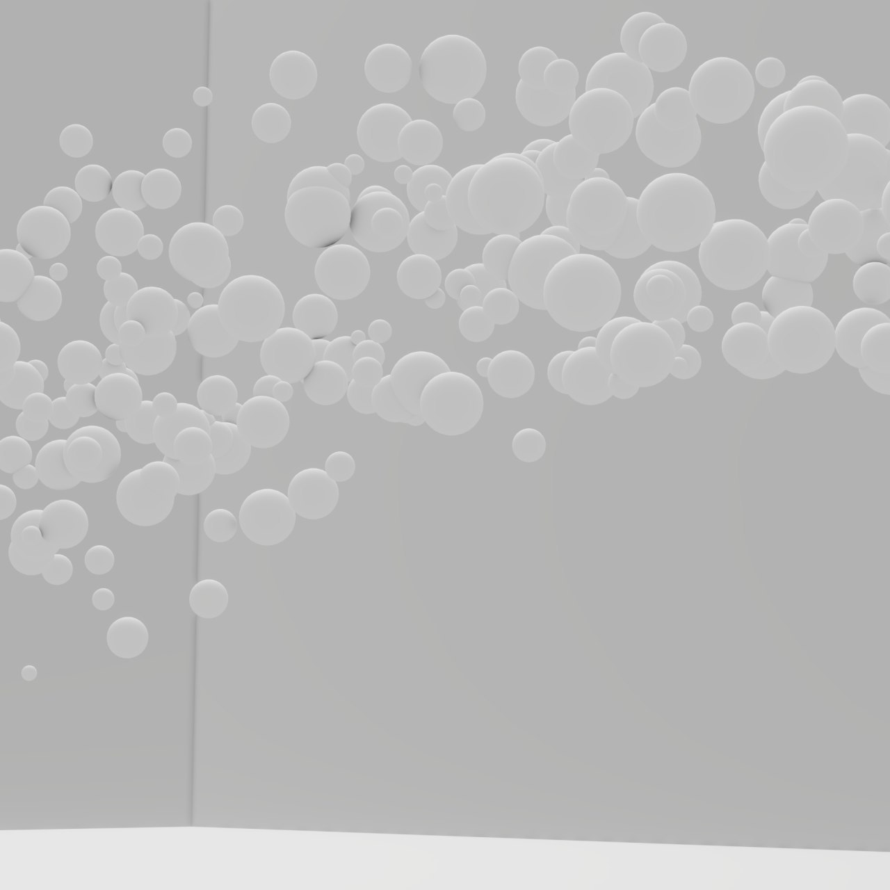

## Images on my Website
A thing which scares me for the longest time. I mean, from a technical perspective of course. Which file-format, aspect ratio, compression rate, file-size, etc..

There are so many things that pop up and need to be considered when on the internet. Normally those kind of decisions are taken automatically taken by the platform you upload the image to. They also get optimized and rendered in different sizes already to load always the best version on the client device. This is responsive... and more efficient... and so on.

But now needing to implement those decisions into my solution with hugo was a breakpoint for me for so long. What if my images are to big and take ages to load. I don't want to have a slow website when I show it of to somebody. At least the thumbnail needs to load quickly. Speeking of which, this needs to be generated for each and every image I put up here (hopefully automatically with the right settings).

Now comes the time to atleast put the first real image up in general.

Just to see how it looks like in general. The workflow, the processing, the actuall loading times...
## The Image

## Summary
I am making progress so far.
It should be possible to get a cover image in this template. But so far I am not aware which path format I should choose to select the image. Maybe it will never be shown, idk. But for now. It was pretty straight forward. This whole post was done in Vim on the terminal and no markdown tools where used to check before, other then just live previewing the page with `hugo serve` in a different pane in `tmux` which is awesome to have.

Now I will publish this post to the web, and hopefully you can see it soon.

Thanks for your time! And have a great day!

~Joh
